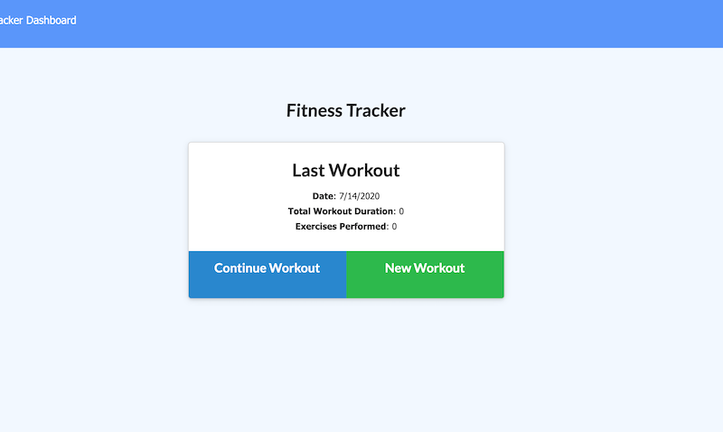
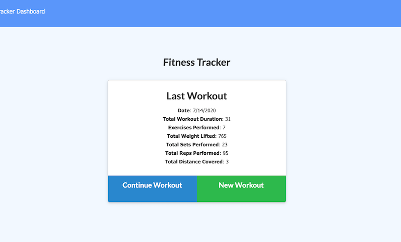
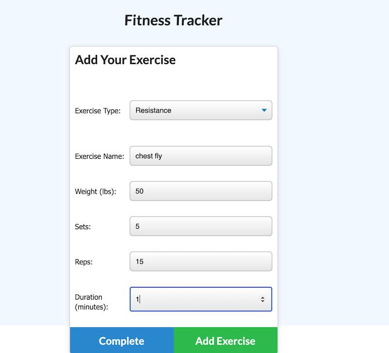
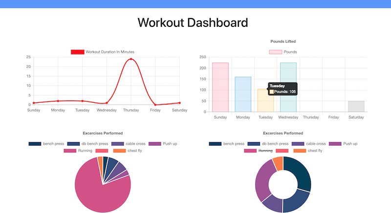

# Workout Tracker

  
  ## Table of Contests
  -[Description](#description)
  -[Instalation](#install)
  -[Usage](#usage)
  -[Licences](#licences)
  -[Contribution](#contribution)
  -[Test](#tests)
  -[Question](#questions)
  
  
  ## Description
  This app is used to keep track of the work outs that the user performs. The user is able to choose from either cardio or resistance type of workouts to formate the style of workout they wish to complete. Questions about that type of workout will then be asked to make sure that the right information is uploaded into the tracker.
  
  ## Install

  npm install
  
  ## Usage

  To track workouts
  
  
  ## Licence

  None
  
  ## Contribution
  Chris Ferguson
  
  ## Test
  
  NA
  
  ## Questions

  ### [cfergus7 GitHub](https://github.com/)  
  
  ### Email cfergus7@gmail.com

  ### https://classique-moliere-19367.herokuapp.com/

  ## Screen Shots
  
  
  
  